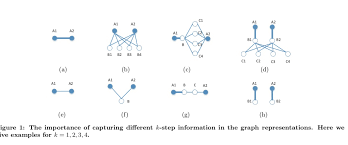
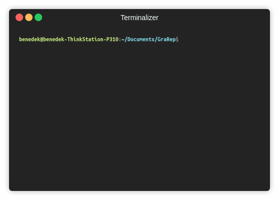

GraRep
======
 [](https://paperswithcode.com/sota/node-classification-on-20news?p=grarep-learning-graph-representations-with) [](https://codebeat.co/projects/github-com-benedekrozemberczki-grarep-master) [](https://github.com/benedekrozemberczki/GraRep/archive/master.zip) [](https://twitter.com/intent/follow?screen_name=benrozemberczki) 

A **SciPy** implementation of *GraRep: Learning Graph Representations with Global Structural Information (WWW 2015)*.
<p align="center">
  
</p>
  
### Abstract 
<p align="justify">
In this paper, we present GraRep, a novel model for learning vertex representations of weighted graphs. This model learns low dimensional vectors to represent vertices appearing in a graph and, unlike existing work, integrates global structural information of the graph into the learning process. We also formally analyze the connections between our work and several previous research efforts, including the DeepWalk model of Perozzi et al. as well as the skip-gram model with negative sampling of Mikolov et al. We conduct experiments on a language network, a social network as well as a citation network and show that our learned global representations can be effectively used as features in tasks such as clustering, classification and visualization. Empirical results demonstrate that our representation significantly outperforms other state-of-the-art methods in such tasks.</p>

The model is now also available in the package [Karate Club](https://github.com/benedekrozemberczki/karateclub).

This repository provides a SciPy implementation of GraRep as described in the paper:

> GraRep: Learning Graph Representations with Global Structural Information.
> ShaoSheng Cao, Wei Lu, and Qiongkai Xu.
> WWW, 2015.
> [[Paper]](https://www.researchgate.net/profile/Qiongkai_Xu/publication/301417811_GraRep/links/5847ecdb08ae8e63e633b5f2/GraRep.pdf)

MatLab and Julia implementations are available [[here]](https://github.com/ShelsonCao/GraRep) and [[respectively here]](https://github.com/xgfs/GraRep.jl).

### Requirements
The codebase is implemented in Python 3.5.2. package versions used for development are just below.
```
networkx          2.4
tqdm              4.28.1
numpy             1.15.4
pandas            0.23.4
texttable         1.5.0
scipy             1.1.0
argparse          1.1.0
scikit-learn      0.20.0
```
### Datasets
<p align="justify">
The code takes the **edge list** of the graph in a csv file. Every row indicates an edge between two nodes separated by a comma. The first row is a header. Nodes should be indexed starting with 0. A sample graph for `Cora` is included in the  `input/edges/` directory. </p>

### Outputs
<p align="justify">
The embedding is saved in the `output/` directory. Each embedding has a header and a column with the node identifiers. Finally, the embedding is sorted by the identifier column.</p>

### Options
Training a model is handled by the `src/main.py` script which provides the following command line arguments.

```
  --edge-path       STR     Edge list csv.                         Default is `input/edges/cora.csv`.
  --output-path     STR     Output embedding csv.                  Default is `output/cora_grarep.csv`.
  --dimensions      INT     Number of dimensions per embedding.    Default is 16.
  --order           INT     Number of adjacency matrix powers.     Default is 5.  
  --iterations      INT     SVD iterations.                        Default is 20.
  --seed            INT     Random seed.                           Default is 42.
```
### Examples
The following commands learn a model and save the embedding. Training a model on the default dataset:
```sh
$ python src/main.py
```
<p align="center">
  
</p>

Training a GraRep model with higher dimension size.
```sh
$ python src/main.py --dimensions 32
```
Changing the batch size.
```sh
$ python src/main.py --order 3
```

-------------------------------

**License**

- [GNU](https://github.com/benedekrozemberczki/GraRep/blob/master/LICENSE)

--------------------------------
